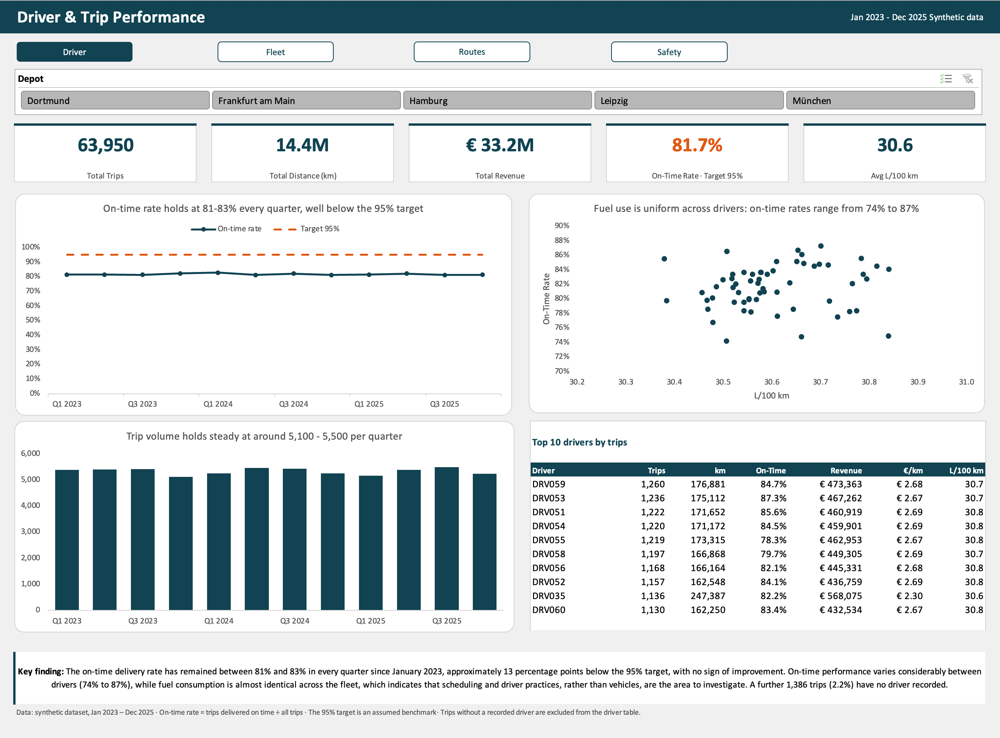
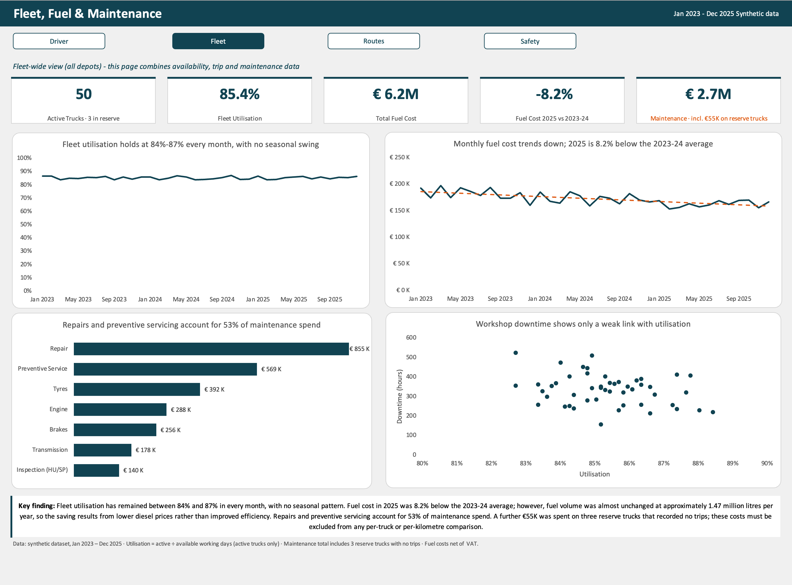
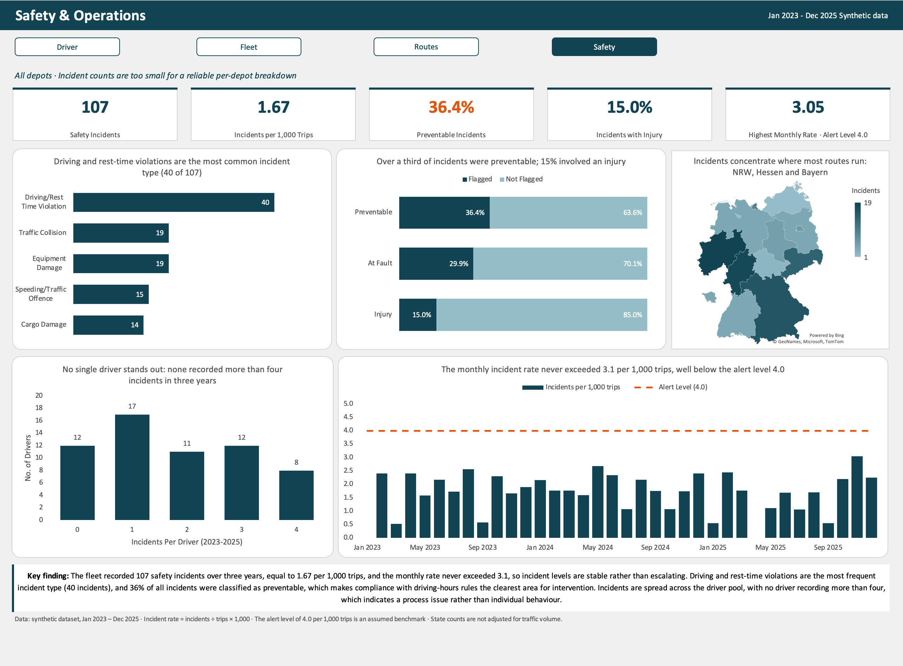

# Logistics Performance Analysis – German Regional Haulier (2023–2025)

## Overview

This project analyses three years of operational data from a regional haulier operating five depots in Germany: Hamburg, Dortmund, Frankfurt am Main, München and Leipzig. The data covers 63,950 trips, 14.4 million kilometres and €33.2 million in revenue, delivered by 60 drivers and 50 active trucks across 42 routes to 120 customers in 15 Bundesländer.

The analysis is organised into four areas: driver and trip performance, fleet and cost management, route and customer performance, and safety. It compares performance over time, across depots, drivers, routes and customers, and against assumed benchmarks, using descriptive statistics and simple correlation.

## Executive Summary

The business is operationally stable but underperforms on its most visible service measure. The on-time delivery rate has remained between 81% and 83% in every quarter since January 2023, approximately 13 percentage points below an assumed 95% target, with no sign of improvement. The shortfall is consistent across all five depots, which indicates a company-wide planning issue rather than a local one.

Fuel costs fell by 8.2% in 2025 compared with the 2023–24 average. Fuel consumption, however, was unchanged, so the saving resulted from lower diesel prices rather than improved efficiency. Long-haul routes generate the most revenue but the lowest revenue per kilometre, and service quality does not differ between high-revenue and low-revenue routes or customers. Safety incident levels are stable and low at 1.67 incidents per 1,000 trips. Driving and rest-time violations are the most frequent incident type, and over a third of incidents were preventable.

The priorities are to investigate late deliveries at planning level, to make driver and truck assignment mandatory at dispatch, and to target compliance with driving-hours rules, which addresses both the largest safety risk and a likely cause of delays.

## Key Findings

### 1. Driver and Trip Performance

- The on-time delivery rate is 81.7% overall. Quarterly values ranged only from 81.2% to 82.8% over twelve quarters, with no upward or downward trend.
- The rate is similar at every depot, from 80.1% in Dortmund to 82.5% in Leipzig. The underperformance is therefore not confined to one location.
- On-time performance varies considerably between individual drivers, from 74.2% to 87.3%. Fuel consumption is almost identical across all drivers (30.4 to 30.8 L/100 km). This indicates that scheduling and driver practices, rather than vehicles, drive the differences in service.
- Trip volume was stable at approximately 5,100 to 5,500 trips per quarter.
- 1,386 trips (2.2%) have no driver recorded and 921 trips (1.4%) have no truck recorded, which limits the accuracy of driver- and vehicle-level analysis.

### 2. Fleet, Fuel and Maintenance

- Fleet utilisation is 85.4% and remained between 84% and 87% in every month, with no seasonal pattern.
- Fuel cost totalled €6.2 million. The 2025 cost was 8.2% below the 2023–24 average. Annual fuel volume stayed at approximately 1.47 million litres throughout, while the average price fell from €1.49 to €1.34 per litre. The saving is price-driven, not efficiency-driven.
- Maintenance cost totalled €2.68 million. Repairs and preventive servicing account for 53% of the spend.
- €55,000 of maintenance cost was recorded on three reserve trucks that completed no trips. These costs were separated from the active fleet to avoid distorting per-truck and per-kilometre comparisons.
- Workshop downtime shows only a weak relationship with utilisation (correlation of approximately −0.28).

### 3. Route and Customer Performance

- Average revenue is €2.31 per kilometre and €519 per trip.
- The highest-revenue route, Hamburg – Leipzig (€1.68 million), earns among the lowest revenue per kilometre (€2.03). Short regional routes earn the most per kilometre, up to €4.70 on Leipzig – Halle, because the fixed charge per delivery is spread over fewer kilometres.
- Service quality does not follow revenue. On-time rates range only from 78.4% to 84.3% across all 42 routes, with no meaningful relationship to route revenue (correlation of −0.11).
- The ten largest customers receive the same service level as all other customers (79.1% to 83.8% on time, against 81.7% overall).
- The largest customer accounts for 9.8% of total revenue (€3.25 million).
- By destination, Sachsen (€5.02 million) and Bayern (€4.91 million) generate the most revenue.

### 4. Safety and Operations

- The fleet recorded 107 safety incidents over three years, equal to 1.67 per 1,000 trips. The monthly rate peaked at 3.05 in November 2025 and never reached the assumed alert level of 4.0.
- Driving and rest-time violations are the most frequent incident type (40 of 107).
- 36.4% of incidents were classified as preventable, 29.9% as at-fault, and 15.0% involved an injury.
- Incidents are spread across the driver pool. 48 of 60 drivers recorded at least one incident, and no driver recorded more than four. This points to a process issue rather than individual behaviour.
- The highest incident counts occurred in Nordrhein-Westfalen, Hessen and Bayern. These counts are not adjusted for traffic volume and largely reflect where most routes operate.

## Recommendations

### High priority

1. **Investigate the causes of late deliveries at planning level.** The on-time shortfall is uniform across depots, quarters and customers, so the most likely causes are systemic: delivery-window commitments, route timing assumptions or dispatch scheduling. A review of planned against actual journey times should precede any target-setting. The fleet completes approximately 21,300 trips a year, of which around 3,900 arrive late; raising the on-time rate from 81.7% to 90% would reduce late deliveries by approximately 1,770 per year.
2. **Make driver and truck assignment mandatory at dispatch.** 3.6% of trips (2,297) lack a driver or truck record, which weakens accountability and analysis.
3. **Target compliance with driving-hours rules.** Driving and rest-time violations are the largest and most preventable incident category. Tachograph monitoring and scheduling that respects rest requirements address both safety and on-time performance.

### Medium priority

4. **Learn from the best-performing drivers.** A 13-percentage-point gap between the strongest and weakest drivers, with identical fuel use, suggests that working practices differ. Structured comparison and peer coaching could raise the fleet average.
5. **Do not treat the fuel saving as an efficiency gain.** Consumption has not improved. A fuel-efficiency programme, such as driver training or idle reduction, together with a review of fuel purchasing contracts, would protect the business when prices rise again.
6. **Review pricing on long-haul routes.** These routes carry the largest volumes at the lowest revenue per kilometre. A minimum per-kilometre rate or a fuel surcharge should be considered.

### Low priority

7. **Reassess the reserve fleet.** Three trucks generated €55,000 in maintenance cost without completing a trip. The business should decide whether to rotate them into service or dispose of them.
8. **Monitor customer concentration.** One customer represents almost 10% of revenue, which presents a dependency risk.

## Limitations

The dataset is synthetic. The 95% on-time target and the 4.0 incident alert level are assumed benchmarks rather than contractual figures. Driver- and vehicle-level results exclude trips without an assignment. Safety counts by state are not adjusted for traffic volume, and the per-depot sample is too small for reliable incident rates. Correlations describe association, not cause.

## Further Work

- **Delay analysis:** examine the distribution and timing of delay minutes to identify when and where late deliveries occur.
- **Route profitability:** combine revenue with fuel and maintenance cost per kilometre to calculate a margin for each route, rather than revenue alone.
- **Fair driver comparison:** adjust driver on-time rates for route mix, since drivers on long-haul routes may face different conditions.
- **Normalised safety rates:** express incidents per 1,000 trips for each Bundesland and depot once more data is available, to allow a fair regional comparison.
- **Customer segmentation:** analyse revenue and service by industry to identify the most valuable customer groups.
- **Forecasting:** project trip volume and fuel cost to support budgeting.
- **A single cross-page filter:** link all tables in a data model so that one filter can apply across every dashboard page.

## Data and Tools

**Data:** A synthetic dataset created for this project, consisting of eight related tables: trips, drivers, trucks, routes, customers, maintenance, truck availability and safety incidents. It covers January 2023 to December 2025. All values are in euros and kilometres.

**Tools:** Microsoft Excel only. The work uses structured tables and helper columns (VLOOKUP, IF, SUMIFS, COUNTIFS), PivotTables with calculated fields, slicers for interactive depot filtering, linked KPI cells, and line, bar, column, scatter and filled map charts.

**Workbook structure:** Dashboards (Driver, Fleet, Route, Safety) → KPIs → pivot sheets (PT_) → raw data tables.

